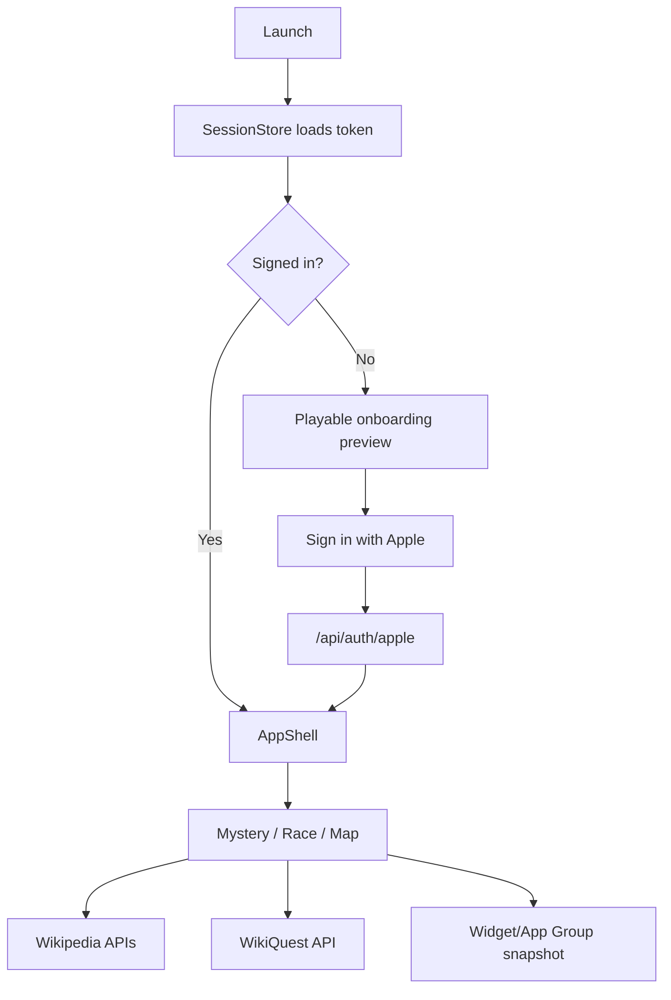

# Architecture

WikiQuest is a SwiftUI app with a small set of clear boundaries.

## Core Objects

- `SessionStore`: Apple sign-in session and WikiQuest bearer token state.
- `PurchaseStore`: RevenueCat purchase, restore, and entitlement sync state.
- `WikiQuestAPIClient`: backend API calls.
- `WikipediaClient`: public Wikipedia summary/search/link/media calls.
- `WikiTheme`: paper/ink/mode tokens and reusable visual primitives.
- `WikiMotion`: durations, springs, ticker motion, and reduced-motion handling.
- `WikiQuestSnapshotStore`: App Group snapshot data for widgets and pending routes.

## App Surfaces

- `AppShell`: signed-in shell and custom dock.
- `OnboardingGate`: signed-out first-run preview and Apple sign-in.
- `HomeView`: Quest Deck session start.
- `DailyMysteryView`: clue, suggestion, score, and result loop.
- `LinkRaceView`: article-to-article race loop.
- `NearbyView`: map-first pin guessing loop.
- `LeaderboardView`: score and rank state.
- `ProfileView`: account, purchases, legal, and discovered article shelf.
- `AppClipView`: local Clip Quest preview.
- `WikiQuestWidgets`: widget and ActivityKit views.

## Data Flow

## Design Rules

- One main visual object per screen.
- One compact HUD strip.
- One bottom command area.
- Use real Wikipedia/Commons media.
- Reveal answer media only when the game state allows it.
- Keep motion short and state-driven.
- Respect Reduce Motion.

## Backend Boundary

The iOS app is a client. Gameplay source of truth, saved XP, profiles, entitlements, and webhooks live in the backend. The app can run public preview surfaces without a private account, but saved progression requires Apple sign-in.
